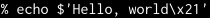
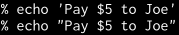
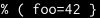
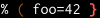

zsh-syntax-highlighting [![Build Status][build-status-image]][build-status-travis]
=======================

**[Fish shell][fish]-like syntax highlighting for [Zsh][zsh].**

*Requirements: zsh 4.3.11+.*

[fish]: http://www.fishshell.com/
[zsh]: http://www.zsh.org/

This package provides syntax highlighting for the shell zsh.  It enables
highlighting of commands whilst they are typed at a zsh prompt into an
interactive terminal.  This helps in reviewing commands before running
them, particularly in catching syntax errors.

Some examples:

Before: 
 
After:&nbsp; 

Before: 
 
After:&nbsp; 

Before: 
 
After:&nbsp; 

How to install
--------------

See [INSTALL.md](INSTALL.md).

FAQ
---

### Why must `zsh-syntax-highlighting.zsh` be sourced at the end of the `.zshrc` file?

`zsh-syntax-highlighting.zsh` wraps ZLE widgets.  It must be sourced after all
custom widgets have been created (i.e., after all `zle -N` calls and after
running `compinit`).  Widgets created later will work, but will not update the
syntax highlighting.

### Does syntax highlighting work during incremental history search?

Highlighting the command line during an incremental history search (by default bound to
to <kbd>Ctrl+R</kbd> in zsh's emacs keymap) requires zsh 5.4 or newer.

Under zsh versions older than 5.4, the zsh-default [underlining][zshzle-Character-Highlighting]
of the matched portion of the buffer remains available, but zsh-syntax-highlighting's
additional highlighting is unavailable.  (Those versions of zsh do not provide
enough information to allow computing the highlighting correctly.)

See issues [#288][i288] and [#415][i415] for details.

[zshzle-Character-Highlighting]: http://zsh.sourceforge.net/Doc/Release/Zsh-Line-Editor.html#Character-Highlighting
[i288]: https://github.com/zsh-users/zsh-syntax-highlighting/pull/288
[i415]: https://github.com/zsh-users/zsh-syntax-highlighting/pull/415

### How are new releases announced?

There is currently no "push" announcements channel.  However, the following
alternatives exist:

- GitHub's RSS feed of releases: https://github.com/zsh-users/zsh-syntax-highlighting/releases.atom
- An anitya entry: https://release-monitoring.org/project/7552/

How to tweak
------------

Syntax highlighting is done by pluggable highlighter scripts.  See the
[documentation on highlighters](docs/highlighters.md) for details and
configuration settings.

[build-status-image]: https://travis-ci.org/zsh-users/zsh-syntax-highlighting.svg?branch=master
[build-status-travis]: https://travis-ci.org/zsh-users/zsh-syntax-highlighting
