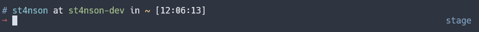
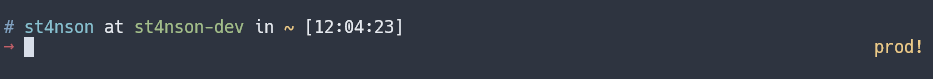

# kubectx - show active kubectl context

This plugins adds ```kubectx_prompt_info()``` function. It shows name of the
active kubectl context (```kubectl config current-context```).

You can use it to customize prompt and know if You are on prod cluster ;)

_Example_. Add to **.zshrc**:

```
RPS1='$(kubectx_prompt_info)'
```

### custom ctx names

One can rename default context name for better readability.

_Example_. Add to **.zshrc**:
```
kubectx_mapping[minikube]="mini"
kubectx_mapping[context_name_from_kubeconfig]="$emoji[wolf_face]"
kubectx_mapping[production_cluster]="%{$fg[yellow]%}prod!%{$reset_color%}"
```



