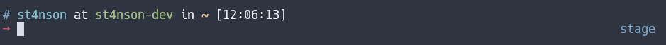
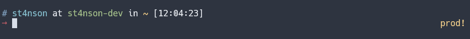

# kubectx - show active kubectl context

This plugins adds `kubectx_prompt_info()` function. It shows name of the active
kubectl context (`kubectl config current-context`).

You can use it to customize prompt and know if You are on prod cluster ;)

To use this plugin, add `kubectx` to the plugins array in your zshrc file:

```zsh
plugins=(... kubectx)
```

### Usage

Add to **.zshrc**:

```zsh
# right prompt
RPS1='$(kubectx_prompt_info)'
# left prompt
PROMPT="$PROMPT"'$(kubectx_prompt_info)'
```

The context is loaded asynchronously on supported versions of zsh so that
`kubectl` does not block the prompt. To restore synchronous behavior, add this
before Oh My Zsh is sourced:

```zsh
zstyle ':omz:alpha:plugins:kubectx' async-prompt no
```

If your theme calls `kubectx_prompt_info` indirectly through another function,
force registration of the async handler instead:

```zsh
zstyle ':omz:alpha:plugins:kubectx' async-prompt force
```

### Custom context names

You can rename the default context name for better readability or additional formatting.
These values accept [prompt expansion sequences](http://zsh.sourceforge.net/Doc/Release/Prompt-Expansion.html)
such as `%F{color}`, `%f`, `%K{color}`, `%k`, `%B`, `%b`, `%U`, `%u`, `%S`, `%s`, `%{...%}`.

**Example**: add this to your .zshrc file:

```zsh
kubectx_mapping[minikube]="mini"
kubectx_mapping[context_name_from_kubeconfig]="$emoji[wolf_face]"
kubectx_mapping[production_cluster]="%{$fg[yellow]%}prod!%{$reset_color%}"
# contexts with spaces
kubectx_mapping[context\ with\ spaces]="%F{red}spaces%f"
# don't use quotes as it will break the prompt
kubectx_mapping["context with spaces"]="%F{red}spaces%f" # ti
```

You can also define the whole mapping array at once:

```zsh
typeset -A kubectx_mapping
kubectx_mapping=(
  minikube                      "mini"
  context_name_from_kubeconfig  "$emoji[wolf_face]"
  production_cluster            "%{$fg[yellow]%}prod!%{$reset_color%}"
  "context with spaces"         "%F{red}spaces%f"
)
```



