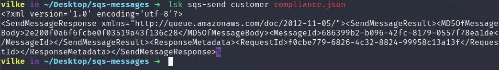

#  Localstack plugin  #

CLI support for LOCALSTACK interaction

##  Description  ##
To use it, add `localstack` to the plugins array in your zshrc file:

```zsh
plugins=(... localstack)
```

##  Usage  ##

This plugin supplies one command, `lsk`, through which all its features are exposed.

## Commands

| Command       | Description                                                           |
| :------------ | :-------------------------------------------------------------------- |
| `lsk sqs-send <queue> <message.json>` | sends a given message in sqs to a given queue |

## Examples


