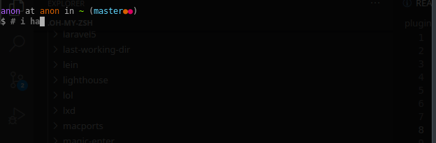

# move-cursor-in-buffer

## description
A plugin for [oh-my-zsh](#https://github.com/ohmyzsh/ohmyzsh/) that allows the 
user to place the cursor at the beginning or end of a multiline command.

## showcase


## installation

1. install [oh-my-zsh](#https://github.com/ohmyzsh/ohmyzsh/)
2. make sure that the plugins array is included in your .zshrc file: \
`plugins=(... move-cursor-in-buffer)`
3. add some [keybindings](#keybindings)

## configuration

### keybindings
To activate the functionality you will need to add some keybindings in your 
.zshrc, for example: \
```
bindkey '^[[1;5H' beginning-of-buffer # ctrl+pos1 key
bindkey '^[[1;5F' end-of-buffer # ctrl+end key
```
