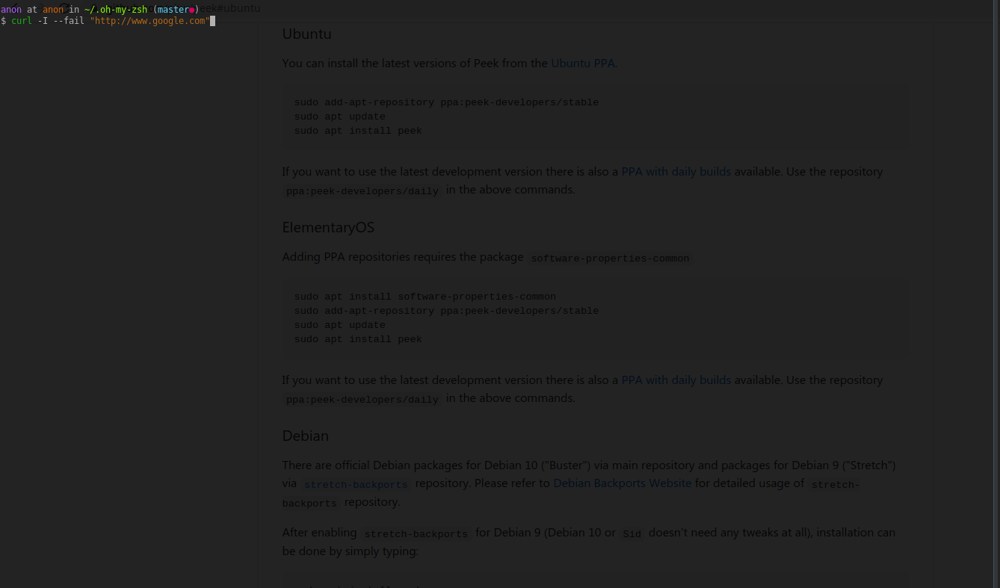

# re-type-on-error

## description
A plugin for [oh-my-zsh](#https://github.com/ohmyzsh/ohmyzsh/) that watches for
 failed commands(=commands with a non-zero exit code). If a command failed in t
he interactive shell, it get immediately re-typed, or maybe call it re-displaye
d to the user for possible corrections.

## showcase

## installation

1. install [oh-my-zsh](#https://github.com/ohmyzsh/ohmyzsh/)
2. make sure that the plugins array is included in your .zshrc file: \
`plugins=(... re-type-on-error)`

## configuration

### environment variables
`ZSH_RETYPE_ON_ERROR_SHOW_DISCLAIMER=true` \
This setting shows a string before the re-typed failed command that indicates:
+ that the previous command failed
+ the exit code of the previous command
+ the default of this setting is true as indicated above, simply set to false 
    if this is not desired
