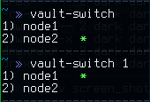

# Vault-switch plugin

## Description

This plugin can switch among nodes of Vault - HashiCorp  

## Configuration

For using a plugin you should add VAULT_NODES to **~/.zshrc**
Variable **VAULT_NODES** must look as  

```bash
VAULT_NODES="node1,https://vault1.example.com,secret_token1;node2,https://vault2.example.com,secret_token2"
```

If you want to skip verify checking of ssl then add true to end of the string.

```bash
VAULT_NODES="node1,https://vault1.example.com,secret_token1,true;node2,https://vault2.example.com,secret_token2"
```

Name of a node, address, token  are separating comma. Other nodes separate semicolon.  
After need to add the name of the plugin to **~/.zshrc** to variable **plugins=(vault-switch)**

**Example usage:**



State of restoring stored in **~/.vault-switch/credentials**  
