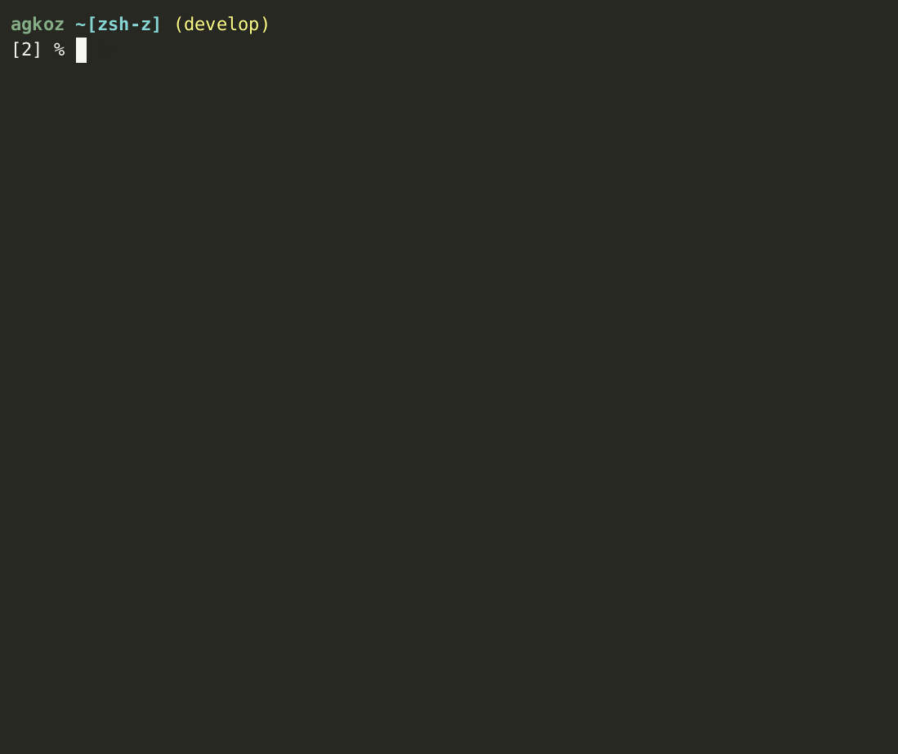

# Zsh-z

Zsh-z is a command-line tool that allows you to jump quickly to directories that you have visited frequently or recently -- but most often a combination of the two (a concept known as ["frecency"](https://en.wikipedia.org/wiki/Frecency)). It works by keeping track of when you go to directories and how much time you spend in them. Based on this data, it predicts where you want to go when you type a partial string. For example, `z src` might take you to `~/src/zsh`. `z zsh` might also get you there, and `z c/z` might prove to be even more specific -- it all depends on your habits and how long you have been using Zsh-z to build up a database. After using Zsh-z for a little while, you will get to where you want to be by typing considerably less than you would need to if you were using `cd`.

Zsh-z is a native Zsh port of [`rupa/z`](https://github.com/rupa/z), a tool written for `bash` and Zsh that uses embedded `awk` scripts to do the heavy lifting. `rupa/z` was my most used command-line tool for a couple of years. I decided to translate it, `awk` parts and all, into pure Zsh script, to see if by eliminating calls to external tools (`awk`, `sort`, `date`, `sed`, `mv`, `rm`, and `chown`) and reducing forking through subshells I could make it faster. The performance increase is impressive, particularly on systems where forking is slow, such as Cygwin, MSYS2, and WSL.

There is also a significant stability improvement. Race conditions have always been a problem with `rupa/z`, and users of that utility occasionally lose their `~/.z` databases. By having Zsh-z only use Zsh (`rupa/z` uses a hybrid shell code standard that works on `bash` as well), I have been able to implement a `zsh/system`-based file-locking mechanism. It is now nearly impossible to crash the database.

There are other, smaller improvements which I document below in [Other Improvements to the Original Functionality of `rupa/z`](#other-improvements-to-the-original-functionality-of-rupaz). For instance, tab completions are now sorted by frecency by default rather than alphabetically (the latter behavior can be restored if you like it -- [see below](#settings)).

Zsh-z is a drop-in replacement for `rupa/z` and will, by default, use the same database (`~/.z`, or whatever database file you specify), so you can go on using `rupa/z` when you launch `bash`.

> ### Zsh-z v2.0
>
> **v2.0 is the most significant release in the project's history.** It is faster than ever at adding, searching, and listing on modern Zsh; it never makes your prompt wait on database writes -- on any platform; it hardens those writes against corruption and against prying eyes; and it makes tab completion "just work" even under `setopt COMPLETE_ALIASES`. See [**v2.0**](#v20) in the News below for the full rundown, and [Performance](#performance) for the benchmarks.

## Table of Contents
- [News](#news)
- [Installation](#installation)
- [Command Line Options](#command-line-options)
- [Settings](#settings)
- [Case Sensitivity](#case-sensitivity)
- [`ZSHZ_UNCOMMON`](#zshz_uncommon)
- [`ZSHZ_OWNER`](#zshz_owner)
- [Making `--add` work for you](#making---add-work-for-you)
- [Performance](#performance)
- [Other Improvements to the Original Functionality of `rupa/z`](#other-improvements-to-the-original-functionality-of-rupaz)
- [Migrating from Other Tools](#migrating-from-other-tools)
- [`COMPLETE_ALIASES`](#complete_aliases)

## News

### v2.0 (August 14, 2026)

Version **2.0** is a major step forward, and these are the changes most worth knowing about:

- **Zsh-z is even faster than before.** Version 2.0 builds on Zsh-z's past successes in optimizing adding to the datafile -- something it does at virtually every prompt -- by streamlining searching and listing, as well. See [Performance](#performance) for the numbers.
- **Database writes never block your prompt** -- on any platform. The per-prompt `--add` has long run in the background on most systems, but Cygwin and MSYS2 did the write in the foreground, because backgrounding there cost a wrapper subshell plus a job. `--add` now runs as a single disowned job (`&!`) everywhere: one fork, no wrapper subshell, no job-control noise. On Cygwin and MSYS2 that turns a foreground write whose cost grows with your datafile (~30 ms at 300 entries, ~300 ms at 1,000) into a flat ~10-12 ms fork. Elsewhere it halves the forks per prompt.
- **Safer, crash-resistant concurrent writes.** Writes are now guarded by a dedicated, stable lockfile using `zsh/system` file locking, with a bounded wait for lock acquisition (the new [`ZSHZ_LOCK_TIMEOUT`](#settings), default `1` second). Write errors are handled gracefully, and locks are always released even if a write is interrupted. On Cygwin and MSYS2 a write is also retried briefly if Windows refuses it: a virus scanner or the search indexer that opens the database in the instant between its being written and its being moved into place makes the move fail, which used to lose that one directory silently. Zsh-z now retries the move briefly.
- **Your database file now has `600` permissions** -- readable and writable only by you -- so that other users on a shared system cannot read your directory history ([#92](https://github.com/agkozak/zsh-z/issues/92)). On Zsh 5+ this uses the in-process `zf_chmod` builtin; on Zsh 4.3.11 it uses a `umask`-in-a-subshell technique that avoids the fork-and-exec of an external `chmod`.
- **`COMPLETE_ALIASES` works automatically in normal setups.** Tab completion no longer breaks when you have `setopt COMPLETE_ALIASES` enabled. Zsh-z registers the alias automatically on the first Tab press, so the manual `compdef` line that earlier versions required is no longer necessary. [See below](#complete_aliases).
- **Fixed a `can't clobber parameter tmpfd` error on some Zsh builds.** On certain Zsh builds, every database write could fail with `can't clobber parameter tmpfd containing file descriptor 0`, leaving an error at each new prompt. The file descriptor used for the temporary database file is now held in an unset scalar rather than one seeded with `0`, so the write never trips Zsh's file-descriptor-clobber guard ([#81](https://github.com/agkozak/zsh-z/issues/81)).
- **A misconfigured database file no longer closes your shell -- or nags you at every prompt.** When `ZSHZ_DATA` points at a directory, or names a file without a directory, Zsh-z now reports the problem and returns instead of calling `exit`. The per-prompt `--add` stays quiet about it, so you are told once, when you actually run `z`, rather than at every prompt ([#103](https://github.com/agkozak/zsh-z/issues/103); props @ahjota).
- **`z -x` can now remove the entry for a directory that no longer exists -- and can no longer crash Zsh 4.3.11.** The removal target used to have to exist on disk, so a database entry whose directory had been deleted -- exactly the entry you most want gone -- could not be removed. `z -x /deleted/dir` (and `z -xR`) now canonicalizes the argument without requiring it to exist, resolving symlinks in as much of the path as is still present. The same change fixes a crash on Zsh 4.3.11, where an upstream bug makes `${x:A}` segfault when the top-level component of the path is missing: `z -x /gone/sub` -- or a `ZSHZ_DATA` pointing into a missing top-level directory -- could kill the shell there.
- **More robust startup and operation.** A version check on an unsupported Zsh no longer risks exiting your interactive shell.

#### Smaller changes you may notice

None of these should need any action from you, but they are the things a v1 user is most likely to spot:

- **`-r` and `-t` can no longer be combined.** They name mutually exclusive sort orders -- rank versus recency -- so `z -rt foo` was always contradictory, and `-t` silently took precedence. It is now rejected with an error message instead of silently picking one.
- **A lockfile appears next to your database.** Writes are serialized through `~/.z.lock` (or `$ZSHZ_DATA` plus `.lock`). It is created `600`, it stays empty, and it is deliberately never deleted -- removing a lockfile that another shell has already opened would reintroduce the very race it exists to prevent. Where `zsh/system` is missing and `zsystem flock` is therefore unavailable -- MobaXterm's cut-down Cygwin is the case in practice -- you will see a short-lived `~/.z.lock.d` **directory** instead, which is created and removed for each write. See [`ZSHZ_LOCK_TIMEOUT`](#settings) for how that fallback behaves.
- **An existing database gets tightened to `600` on the next write.** If your `~/.z` predates this release and is `644`, the first write will re-mode it. This is the [#92](https://github.com/agkozak/zsh-z/issues/92) fix applied to databases you already have, not just newly created ones. Setting the mode is treated as part of the write rather than a courtesy afterwards: if it cannot be done, the write is abandoned and reports failure instead of publishing a database that anyone on the machine could read.

The dated entries below remain the historical record of changes leading up to v2.0.

    
Here are the older features and updates.

- May 6, 2026
    + Zsh-z will now handle paths with dollar signs (`$`) in them.
    + Workaround for Zsh emulating `sh`/`bash`/`ksh`.
- May 1, 2026
    + Various tab completion bugs resolved.
- April 27, 2026
    + Fixes a bug where re-sourcing the script caused an infinite loop when tab was pressed. Props to @maheshpec for [successfully diagnosing the problem](https://github.com/ohmyzsh/ohmyzsh/pull/13715).
    + Fixes a bug where the completion widget was not identifying options correctly.
- March 31, 2026
    + When the user hits tab after entering a command-line argument that uses spaces as wildcards (e.g., `z us lo bi`), the command line is clear of detritus (i.e., it looks like `z /usr/local/bin` instead of `z us lo /usr/local/bin`).
    + Improved test for Docker containers.
- August 24, 2023
    + Zsh-z will now run when `setopt NO_UNSET` has been enabled (props @ntninja).
- August 23, 2023
    + Better logic for loading `zsh/files` (props @z0rc).
- August 2, 2023
    + Zsh-z still uses the `zsh/files` module when possible but will fall back on the standard `chown`, `mv`, and `rm` commands in its absence.
- April 27, 2023
    + Zsh-z now allows the user to specify the directory-changing command using the `ZSHZ_CD` environment variable (default: `builtin cd`; props @basnijholt).
- January 27, 2023
    + If the database file directory specified by `ZSHZ_DATA` or `_Z_DATA` does not already exist, create it (props @mattmc3).
- June 29, 2022
    + Zsh-z is less likely to leave temporary files sitting around (props @mafredri).
- June 27, 2022
    + A bug was fixed which was preventing paths with spaces in them from being updated ([#61](https://github.com/agkozak/zsh-z/issues/61)).
    + If writing to the temporary database file fails, the database will not be clobbered (props @mafredri).
- December 19, 2021
    + Zsh-z will now display tildes for `HOME` during completion when `ZSHZ_TILDE=1` has been set.
- November 11, 2021
    + A bug was fixed which was preventing ranks from being incremented.
    + `--add` has been made to work with relative paths and has been documented for the user.
- October 14, 2021
    + Completions were being sorted alphabetically, rather than by rank; this error has been fixed.
- September 25, 2021
    + Orthographical change: "Zsh," not "ZSH."
- September 23, 2021
    + `z -xR` will now remove a directory *and its subdirectories* from the database.
    + `z -x` and `z -xR` can now take an argument; without one, `PWD` is assumed.
- September 7, 2021
    + Fixed the unload function so that it removes the `$ZSHZ_CMD` alias (default: `z`).
- August 27, 2021
    + Using `print -v ... -f` instead of `print -v` to work around longstanding bug in Zsh involving `print -v` and multibyte strings.
- August 13, 2021
    + Fixed the explanation string printed during completion so that it may be formatted with `zstyle`.
    + Zsh-z now declares `ZSHZ_EXCLUDE_DIRS` as an array with unique elements so that you do not have to.
- July 29, 2021
    + Temporarily disabling the use of `print -v`, which was mangling CJK multibyte strings.
- July 27, 2021
    + Internal escaping of path names now works with older versions of Zsh.
    + Zsh-z now detects and discards any incomplete or incorrectly formatted database entries.
- July 10, 2021
    + Setting `ZSHZ_TRAILING_SLASH=1` makes it so that a search pattern ending in `/` can match the end of a path; e.g. `z foo/` can match `/path/to/foo`.
- June 25, 2021
    + Setting `ZSHZ_TILDE=1` displays the `HOME` directory as `~`.
- May 7, 2021
    + Setting `ZSHZ_ECHO=1` will cause Zsh-z to display the new path when you change directories.
    + Better escaping of path names to deal with paths containing the characters ``\`()[]``.
- February 15, 2021
    + Ranks are displayed the way `rupa/z` now displays them, i.e. as large integers. This should help Zsh-z to integrate with other tools.
- January 31, 2021
    + Zsh-z is now efficient enough that, on MSYS2 and Cygwin, it is faster to run it in the foreground than it is to fork a subshell for it. (Behavior superseded in v2.0.)
    + `_zshz_precmd` simply returns if `PWD` is `HOME` or in `ZSHZ_EXCLUDE_DIRS`, rather than waiting for `zshz` to do that.
- January 17, 2021
    + Made sure that the `PUSHD_IGNORE_DUPS` option is respected.
- January 14, 2021
    + The `z -h` help text now breaks at spaces.
    + `z -l` was not working for Zsh version < 5.
- January 11, 2021
    + Major refactoring of the code.
    + `z -lr` and `z -lt` work as expected.
    + `EXTENDED_GLOB` has been disabled within the plugin to accommodate old-fashioned Windows directories with names such as `Progra~1`.
    + Removed `zshelldoc` documentation.
- January 6, 2021
    + I have corrected the frecency routine so that it matches `rupa/z`'s math, but for the present, Zsh-z will continue to display ranks as 1/10000th of what they are in `rupa/z` -- [they had to multiply theirs by 10000](https://github.com/rupa/z/commit/f1f113d9bae9effaef6b1e15853b5eeb445e0712) to work around `bash`'s inadequacies at dealing with decimal fractions.
- January 5, 2021
    + If you try `z foo`, and `foo` is not in the database but `${PWD}/foo` is a valid directory, Zsh-z will `cd` to it.
- December 22, 2020
    + `ZSHZ_CASE`: when set to `ignore`, pattern matching is case-insensitive; when set to `smart`, patterns are matched case-insensitively when they are all lowercase and case-sensitively when they have uppercase characters in them (a behavior very much like Vim's `smartcase` setting).
    + `ZSHZ_KEEP_DIRS` is an array of directory names that should not be removed from the database, even if they are not currently available (useful when a drive is not always mounted).
    + Symlinked database files were having their symlinks overwritten; this bug has been fixed.

## Installation

### General observations

This plugin can be installed simply by putting the various files in a directory together and by sourcing `zsh-z.plugin.zsh` in your `.zshrc`:

    source /path/to/zsh-z.plugin.zsh

Tab completion requires `compinit`. `_zshz` *must* also be in the same directory as `zsh-z.plugin.zsh`. The frameworks handle both of these requirements, but if you are not using a framework, put

    autoload -U compinit; compinit

in your `.zshrc` somewhere below where you source `zsh-z.plugin.zsh` -- the plugin adds its directory to `fpath` at source time, and `compinit` needs to see it there in order to find `_zshz`.

If you add

    zstyle ':completion:*' menu select

to your `.zshrc`, your completion menus will look very nice. This `zstyle` invocation should work with any of the frameworks below as well.

### For [antigen](https://github.com/zsh-users/antigen) users

Add the line

    antigen bundle agkozak/zsh-z

to your `.zshrc`, somewhere above the line that says `antigen apply`.

### For [Oh My Zsh](http://ohmyz.sh/) users

Zsh-z is now included as part of Oh My Zsh! As long as you are using an up-to-date installation of Oh My Zsh, you can activate Zsh-z simply by adding `z` to your `plugins` array in your `.zshrc`, e.g.,

    plugins=( git z )

It is as simple as that.

If, however, you prefer always to use the latest version of Zsh-z from the `agkozak/zsh-z` repo, you may install it thus:

    git clone https://github.com/agkozak/zsh-z ${ZSH_CUSTOM:-~/.oh-my-zsh/custom}/plugins/zsh-z

and activate it by adding `zsh-z` to the line of your `.zshrc` that specifies `plugins=()`, e.g., `plugins=( git zsh-z )`.

### For [prezto](https://github.com/sorin-ionescu/prezto) users

Execute the following command:

    git clone https://github.com/agkozak/zsh-z.git ~/.zprezto-contrib/zsh-z

Then edit your `~/.zpreztorc` file. Make sure the line that says

    zstyle ':prezto:load' pmodule-dirs $HOME/.zprezto-contrib

is uncommented. Then find the section that specifies which modules are to be loaded; it should look something like this:

    zstyle ':prezto:load' pmodule \
        'environment' \
        'terminal' \
        'editor' \
        'history' \
        'directory' \
        'spectrum' \
        'utility' \
        'completion' \
        'prompt'

Add a backslash to the end of the last line and add `'zsh-z'` to the list, e.g.,

    zstyle ':prezto:load' pmodule \
        'environment' \
        'terminal' \
        'editor' \
        'history' \
        'directory' \
        'spectrum' \
        'utility' \
        'completion' \
        'prompt' \
        'zsh-z'

Then relaunch `zsh`.

### For [zcomet](https://github.com/agkozak/zcomet) users

Simply add

    zcomet load agkozak/zsh-z

to your `.zshrc` (below where you source `zcomet.zsh` and above where you run `zcomet compinit`).

### For [zgen](https://github.com/tarjoilija/zgen) users

Add the line

    zgen load agkozak/zsh-z

somewhere above the line that says `zgen save`. Then run

    zgen reset
    zsh

to refresh your init script.

### For [Zim](https://github.com/zimfw/zimfw)

Add the following line to your `.zimrc`:

    zmodule https://github.com/agkozak/zsh-z

Then run

    zimfw install

and restart your shell.

### For [Zinit](https://github.com/zdharma-continuum/zinit) users

Add the line

    zinit load agkozak/zsh-z

to your `.zshrc`.

Zsh-z supports `zinit`'s `unload` feature; just run `zinit unload agkozak/zsh-z` to restore the shell to its state before Zsh-z was loaded. It gives back only what it took: the `fpath` entry is removed only if Zsh-z was the one that added it, so a directory your plugin manager put there is left alone, and the Tab-completion mapping is dropped only while it still points at Zsh-z's own completer.

### For [Znap](https://github.com/marlonrichert/zsh-snap) users

Add the line

    znap source agkozak/zsh-z

somewhere below the line where you `source` Znap itself.

### For [zplug](https://github.com/zplug/zplug) users

Add the line

    zplug "agkozak/zsh-z"

somewhere above the line that says `zplug load`. Then run

    zplug install
    zplug load

to install Zsh-z.

## Command Line Options

- `--add` Add a directory to the database
- `-c`    Only match subdirectories of the current directory
- `-e`    Echo the best match without going to it
- `-h`    Display help
- `-l`    List all matches without going to them
- `-r`    Match by rank (i.e. how much time you spend in directories)
- `-t`    Time -- match by how recently you have been to directories
- `-x`    Remove a directory (by default, the current directory) from the database
- `-xR`   Remove a directory (by default, the current directory) and its subdirectories from the database

## Settings

Zsh-z has environment variables (they all begin with `ZSHZ_`) that change its behavior if you set them. You can also keep your old ones if you have been using `rupa/z` (whose environment variables begin with `_Z_`).

* `ZSHZ_CASE` can be `ignore`, for case-insensitive matching, or `smart`, for Vim-like `smartcase` matching; [see below](#case-sensitivity) (default: empty, i.e., a case-sensitive match is tried first, then a case-insensitive one)
* `ZSHZ_CMD` changes the command name (default: `z`)
* `ZSHZ_CD` specifies the default directory-changing command (default: `builtin cd`)
* `ZSHZ_COMPLETION` can be `'frecent'` (default) or `'legacy'`, depending on whether you want your completion results sorted according to frecency or simply sorted alphabetically
* `ZSHZ_DATA` changes the database file (default: `~/.z`)
* `ZSHZ_ECHO` displays the new path name when changing directories (default: `0`)
* `ZSHZ_EXCLUDE_DIRS` is an array of directories to keep out of the database (default: empty)
* `ZSHZ_KEEP_DIRS` is an array of directories that should not be removed from the database, even if they are not currently available (useful when a drive is not always mounted) (default: empty)
* `ZSHZ_LOCK_TIMEOUT` is the number of seconds to wait for the database lock before giving up on a write (default: `1`). Where `zsh/system` is unavailable and `zsystem flock` cannot be used -- MobaXterm's cut-down Cygwin, for instance -- Zsh-z serializes writes with an atomic `mkdir` on `~/.z.lock.d` instead, and this setting bounds the wait the same way. That fallback has no equivalent of the kernel releasing a lock when its holder dies, so a lock directory older than 30 seconds is treated as abandoned and cleared; a write takes milliseconds, so nothing legitimate is ever that old. A write that times out is dropped silently -- the automatic `precmd` add is best-effort -- so if the database seems to stop updating, the lock is probably contended: run `z --add .` by hand and check `$?`. A `2` is a lock-acquisition timeout, which confirms contention -- look for a stale process holding `~/.z.lock` (or a leftover `~/.z.lock.d` directory on the fallback path), or raise this setting. A `1` is something else entirely, usually a permissions or ownership problem, such as a root-owned `~/.z` or `~/.z.lock` left behind by an earlier `sudo -s` session.
* `ZSHZ_MAX_SCORE` is the maximum combined score the database entries can have before they begin to age and potentially drop out of the database (default: 9000)
* `ZSHZ_NO_RESOLVE_SYMLINKS` prevents symlink resolution (default: `0`)
* `ZSHZ_OWNER` is the username the database belongs to; set it to your own login name to keep `z` working in a root shell, such as under `sudo -E -s`; [see below](#zshz_owner) (default: empty)
* `ZSHZ_TILDE` displays the name of the `HOME` directory as a `~` (default: `0`)
* `ZSHZ_TRAILING_SLASH` makes it so that a search pattern ending in `/` can match the final element in a path; e.g., `z foo/` can match `/path/to/foo` (default: `0`)
* `ZSHZ_UNCOMMON` changes the logic used to calculate the directory jumped to; [see below](#zshz_uncommon) (default: `0`)

## Case sensitivity

The default behavior of Zsh-z is to try to find a case-sensitive match. If there is none, then Zsh-z tries to find a case-insensitive match.

Some users prefer simple case-insensitivity; this behavior can be enabled by setting

    ZSHZ_CASE=ignore

If you like Vim's `smartcase` setting, where lowercase patterns are case-insensitive while patterns with any uppercase characters are treated case-sensitively, try setting

    ZSHZ_CASE=smart

## `ZSHZ_UNCOMMON`

A common complaint about the default behavior of `rupa/z` and Zsh-z involves "common prefixes." If you type `z code` and the best matches, in increasing order, are

    /home/me/code/foo
    /home/me/code/bar
    /home/me/code/bat

Zsh-z will see that all possible matches share a common prefix and will send you to that directory -- `/home/me/code` -- which is often a desirable result. But if the possible matches are

    /home/me/.vscode/foo
    /home/me/code/foo
    /home/me/code/bar
    /home/me/code/bat

then there is no common prefix. In this case, `z code` will simply send you to the highest-ranking match, `/home/me/code/bat`.

You may enable an alternate, experimental behavior by setting `ZSHZ_UNCOMMON=1`. If you do that, Zsh-z will not jump to a common prefix, even if one exists. Instead, it chooses the highest-ranking match -- but it drops any subdirectories that do not include the search term. So if you type `z bat` and `/home/me/code/bat` is the best match, that is exactly where you will end up. If, however, you had typed `z code` and the best match was also `/home/me/code/bat`, you would have ended up in `/home/me/code` (because `code` was what you had searched for). This feature is still in development, and feedback is welcome.

## `ZSHZ_OWNER`

If you are using `root` privileges while keeping your personal home directory as `HOME` (as is the case with `sudo -E -s`), conflicts with file ownership arise. You can resolve them by using `ZSHZ_OWNER`. If you set this variable to your username, Zsh-z will be able to use your personal datafile, restoring its proper ownership with every write.

Setting `ZSHZ_OWNER` makes one thing stricter, because a privileged shell is then writing to a path that an unprivileged user controls: Zsh-z follows a symlink on the way to the datafile -- the file itself, or any parent directory -- only if `root` owns the link, and reports an error instead of writing otherwise. Symlinked system directories, such as `/home` → `/usr/home` on the BSDs or `/var` → `/private/var` on macOS, belong to root and still resolve. With `ZSHZ_OWNER` unset none of this applies: a symlinked `~/.z` is followed exactly as before, so pointing it at synced storage keeps working.

## Making `--add` Work for You

Zsh-z internally uses the `--add` option to add paths to its database. @zachriggle pointed out to me that users might want to use `--add` themselves, so I have altered it a little to make it more user-friendly.

A good example might involve a directory tree that has Git repositories within it. The working directories could be added to the Zsh-z database as a batch with

    for i in $(find $PWD -maxdepth 3 -name .git -type d); do
      z --add ${i:h}
    done

(As a Zsh user, I tend to use `**` instead of `find`, but it is good to see how deep your directory trees go before doing that.)

## Performance

One of the goals of the rewrite that culminated in v2.0 was to make Zsh-z simultaneously more stable and faster. On modern Zsh, Zsh-z outpaces `rupa/z`'s `z.sh` at adding, searching, and listing. Representative figures (N = 200 database entries, medians of seven interleaved runs on a Core i7-12700 desktop under WSL2):

**Modern Zsh (5.9) -- Zsh-z vs. `rupa/z`:**

| Operation | `rupa/z` (`z.sh`) | Zsh-z       | Winner            |
| --------- | ----------------- | ----------- | ----------------- |
| `add`     |  6.25 ms/op       |  1.99 ms/op | **Zsh-z** ~3.14x  |
| `search`  |  6.51 ms/op       |  3.62 ms/op | **Zsh-z** ~1.80x  |
| `list`    |  8.93 ms/op       |  4.36 ms/op | **Zsh-z** ~2.05x  |

**Zsh 4.3.11 (the oldest supported release) -- Zsh-z vs. `rupa/z`:**

| Operation | `rupa/z` (`z.sh`) | Zsh-z       | Winner            |
| --------- | ----------------- | ----------- | ----------------- |
| `add`     |  5.00 ms/op       |  2.92 ms/op | **Zsh-z** ~1.71x  |
| `search`  |  4.93 ms/op       |  4.47 ms/op | **Zsh-z** ~1.10x  |
| `list`    |  7.92 ms/op       |  6.08 ms/op | **Zsh-z** ~1.30x  |

Removal is absent from these tables: in `rupa/z`, the per-prompt hook re-adds the current directory right after `z -x` removes it, so the two implementations' `-x` are not doing comparable work.

Relative to the previous generation of Zsh-z, the v2.0 read path is dramatically faster -- on modern Zsh, listing the whole database is about 2.4x faster and searching about 1.6x faster.

## Other Improvements to the Original Functionality of `rupa/z`

* `z -x` works: a directory you remove stays removed.
* Zsh-z is compatible with Solaris.
* Zsh-z uses the "new" `zshcompsys` completion system instead of the old `compctl` one.
* No error message is displayed when the database file has not yet been created.
* Special characters (e.g., `[`) in directory names are now supported.
* If `z -l` returns only one match, a common root is not printed.
* Exit status codes are more logical.
* Completions now work with options `-c`, `-r`, and `-t`.
* If `~/foo` and `~/foob` are matches, `~/foo` is no longer considered the common root. Only a common parent directory can be a common root.
* `z -x` and the new, recursive `z -xR` can now accept an argument so that you can remove directories other than `PWD` from the database.
* Zsh-z inherits `rupa/z`'s behavior of allowing spaces as wildcards (e.g., `z us lo bi` might take you to `/usr/local/bin`), but now completion of such command lines does not result in visual detritus.

## Migrating from Other Tools

Zsh-z's database format is identical to that of `rupa/z`. You may switch freely between the two tools (I still use `rupa/z` for `bash`). `fasd` also uses that database format, but it stores it by default in `~/.fasd`, so you will have to `cp ~/.fasd ~/.z` if you want to use your old directory history.

If you are coming to Zsh-z (or even to the original `rupa/z`, for that matter) from `autojump`, try using my [`jumpstart-z`](https://github.com/agkozak/jumpstart-z/blob/master/jumpstart-z) tool to convert your old database to the Zsh-z format, or simply run

    awk -F "\t" '{printf("%s|%0.f|%s\n", $2, $1, '"$(date +%s)"')}' < /path/to/autojump.txt > ~/.z

## `COMPLETE_ALIASES`

`z`, or any alternative you set up using `$ZSHZ_CMD` or `$_Z_CMD`, is an alias. `setopt COMPLETE_ALIASES` divorces the tab completion for aliases from the underlying commands they invoke, which historically broke Zsh-z's tab completion. Zsh-z now handles this automatically: the first Tab press registers the alias name with `_zshz` so completion works under `COMPLETE_ALIASES` without any extra setup.

That registration happens inside Zsh-z's own Tab widget. If a plugin loaded after Zsh-z replaces the Tab binding without invoking the previous widget, Zsh-z's widget never runs and the registration does not happen. Under `COMPLETE_ALIASES`, you would then have no completion for `z`. Once `compinit` has run, adding

    compdef _zshz ${ZSHZ_CMD:-${_Z_CMD:-z}}

below `setopt COMPLETE_ALIASES` in your `.zshrc` fixes that, and it is harmless if the automatic registration has already run.
