# check_for_upgrade.sh: Update Process

## Visual State Diagram

```mermaid
stateDiagram-v2
    [*] --> Bootstrap

    state Bootstrap {
      [*] --> CheckLegacyUpdateFile
      CheckLegacyUpdateFile: check [[ -f ~/.zsh-update && ! -f $ZSH_CACHE_DIR/.zsh-update ]]
      CheckLegacyUpdateFile --> MigrateLegacyFile: TRUE
      CheckLegacyUpdateFile --> LoadMode: FALSE
      MigrateLegacyFile: mv ~/.zsh-update $ZSH_CACHE_DIR/.zsh-update
      MigrateLegacyFile --> LoadMode

      LoadMode: read update mode from zstyle
      LoadMode --> LegacyModeFallback: fail
      LegacyModeFallback: set update_mode=prompt
      LegacyModeFallback --> LegacyPromptFlag
      LegacyPromptFlag: evaluate DISABLE_UPDATE_PROMPT
      LegacyPromptFlag --> LegacyAutoFlag
      LegacyAutoFlag: evaluate DISABLE_AUTO_UPDATE
      LegacyAutoFlag --> PreFlightGate
      LoadMode --> PreFlightGate: success
    }

    PreFlightGate: aggregated early-return gate
    PreFlightGate --> ExitNoUpdate: mode=disabled
    PreFlightGate --> ExitNoUpdate: write permission or owner check failed
    PreFlightGate --> ExitNoUpdate: tty gate failed
    PreFlightGate --> ExitNoUpdate: git command unavailable
    PreFlightGate --> ExitNoUpdate: repository check failed
    PreFlightGate --> ModeDispatch: all checks pass
    ExitNoUpdate: unset update_mode; return

    state ModeDispatch {
      [*] --> SetupBackgroundHooks: mode=background-alpha
      [*] --> RunHandleUpdate: otherwise
    }

    SetupBackgroundHooks: autoload -Uz add-zsh-hook
    SetupBackgroundHooks --> RegisterBgPrecmd
    RegisterBgPrecmd: add-zsh-hook precmd _omz_bg_update
    RegisterBgPrecmd --> BackgroundStatusHook

    RunHandleUpdate --> HandleUpdateCore

    state HandleUpdateCore {
      [*] --> LockCleanupCheck
      LockCleanupCheck: load datetime and read lock mtime
      LockCleanupCheck --> CheckStaleAge: lock exists
      LockCleanupCheck --> AcquireLock: no lock

      CheckStaleAge: stale if lock older than 24h
      CheckStaleAge --> RemoveStaleLock: TRUE
      CheckStaleAge --> AcquireLock: FALSE

      RemoveStaleLock: rm -rf $ZSH/log/update.lock
      RemoveStaleLock --> AcquireLock

      AcquireLock: mkdir $ZSH/log/update.lock
      AcquireLock --> ExitHandle: fail (lock exists)
      AcquireLock --> InstallTrap: success

      InstallTrap: install trap to cleanup lock and functions
      InstallTrap --> LoadStatusFile

      LoadStatusFile: source status file and validate last epoch
      LoadStatusFile --> InitStatusFile: fail or empty LAST_EPOCH
      LoadStatusFile --> FrequencyCheck: success

      InitStatusFile: update_last_updated_file
      InitStatusFile --> ExitHandle

      FrequencyCheck: resolve frequency from zstyle or default
      FrequencyCheck --> PeriodElapsed

      PeriodElapsed: enough days elapsed since last check
      PeriodElapsed --> RepoCheck: TRUE
      PeriodElapsed --> ExitHandle: FALSE

      RepoCheck: verify ZSH path is a git repository
      RepoCheck --> CheckUpdateAvailable: success
      RepoCheck --> ExitHandle: fail

      CheckUpdateAvailable --> ReminderOrTypedInput: update available (return 0)
      CheckUpdateAvailable --> ExitHandleWithTimestamp: no update (return 1)

      ExitHandleWithTimestamp: update_last_updated_file
      ExitHandleWithTimestamp --> ExitHandle

      ReminderOrTypedInput --> ReminderExit: mode=reminder
      ReminderOrTypedInput --> TypedInputCheck: mode!=background-alpha
      ReminderOrTypedInput --> ModeAutoGate: mode=background-alpha

      TypedInputCheck: detect pending typed input from terminal
      TypedInputCheck --> ReminderExit: input detected
      TypedInputCheck --> ModeAutoGate: no input

      ReminderExit: echo reminder message
      ReminderExit --> ExitHandle

      ModeAutoGate --> RunUpgrade: mode is auto or background alpha
      ModeAutoGate --> PromptUser: mode=prompt

      PromptUser: read -r -k 1 option
      PromptUser --> RunUpgrade: yes or enter
      PromptUser --> WriteTimestampOnly: [nN]
      PromptUser --> ManualMsg: other

      WriteTimestampOnly: update_last_updated_file
      WriteTimestampOnly --> ManualMsg

      ManualMsg: echo manual update hint
      ManualMsg --> ExitHandle

      RunUpgrade --> ExitHandle
      ExitHandle --> [*]
    }

    state CheckUpdateAvailable {
      [*] --> ReadBranch
      ReadBranch: read configured branch default master
      ReadBranch --> ReadRemote
      ReadRemote: read configured remote default origin
      ReadRemote --> ReadRemoteUrl
      ReadRemoteUrl: read remote URL from git config
      ReadRemoteUrl --> ParseRemoteStyle

      ParseRemoteStyle --> AssumeUpdateYes: non-GitHub remote
      ParseRemoteStyle --> ValidateOfficialRepo: GitHub URL

      ValidateOfficialRepo --> AssumeUpdateYes: repo != ohmyzsh/ohmyzsh
      ValidateOfficialRepo --> LocalHeadCheck: repo == ohmyzsh/ohmyzsh

      LocalHeadCheck: resolve local branch HEAD hash
      LocalHeadCheck --> AssumeUpdateYes: fail
      LocalHeadCheck --> RemoteHeadFetch: success

      RemoteHeadFetch --> UseCurl: curl available
      RemoteHeadFetch --> UseWget: wget available
      RemoteHeadFetch --> UseFetch: fetch available
      RemoteHeadFetch --> AssumeUpdateNo: none available

      UseCurl: fetch remote head using curl
      UseWget: fetch remote head using wget
      UseFetch: fetch remote head using fetch utility

      UseCurl --> CompareHeads: success
      UseCurl --> AssumeUpdateNo: fail
      UseWget --> CompareHeads: success
      UseWget --> AssumeUpdateNo: fail
      UseFetch --> CompareHeads: success
      UseFetch --> AssumeUpdateNo: fail

      CompareHeads: compare local and remote head hashes
      CompareHeads --> MergeBaseCheck: TRUE
      CompareHeads --> AssumeUpdateNo: FALSE

      MergeBaseCheck: compute merge base from both hashes
      MergeBaseCheck --> AssumeUpdateYes: fail
      MergeBaseCheck --> EvaluateAncestry: success

      EvaluateAncestry: decide if local is behind remote
      EvaluateAncestry --> AssumeUpdateYes: TRUE
      EvaluateAncestry --> AssumeUpdateNo: FALSE

      AssumeUpdateYes --> [*]
      AssumeUpdateNo --> [*]
    }

    state RunUpgrade {
      [*] --> ResolveVerbose
      ResolveVerbose: resolve verbose mode from zstyle
      ResolveVerbose --> CheckP10kPrompt

      CheckP10kPrompt: check instant prompt setting
      CheckP10kPrompt --> ForceSilent: TRUE
      CheckP10kPrompt --> UpgradePath: FALSE

      ForceSilent: verbose_mode=silent
      ForceSilent --> UpgradePath

      UpgradePath --> InteractiveUpgrade: mode != background-alpha
      UpgradePath --> SilentCaptureUpgrade: mode=background-alpha

      InteractiveUpgrade: run upgrade script with interactive verbosity
      InteractiveUpgrade --> UpdateTimestampOnly: success
      InteractiveUpgrade --> SilentCaptureUpgrade: fail

      SilentCaptureUpgrade: run upgrade script and capture output
      SilentCaptureUpgrade --> UpdateSuccessStatus: success
      SilentCaptureUpgrade --> UpdateErrorStatus: fail

      UpdateTimestampOnly: update_last_updated_file
      UpdateSuccessStatus: write status file with success
      UpdateErrorStatus: write status file with captured error

      UpdateTimestampOnly --> [*]
      UpdateSuccessStatus --> [*]
      UpdateErrorStatus --> [*]
    }

    state BackgroundStatusHook {
      [*] --> RegisterStatusHook
      RegisterStatusHook: register precmd status hook
      RegisterStatusHook --> PollStatus

      PollStatus: poll status file on each precmd
      PollStatus --> WaitMore: status file not ready
      PollStatus --> PrintSuccess: EXIT_STATUS==0
      PollStatus --> PrintFailure: EXIT_STATUS!=0

      WaitMore: return 1 (continue polling)
      WaitMore --> [*]

      PrintSuccess: print success message
      PrintSuccess --> CleanupStatusHook

      PrintFailure: print error message with details
      PrintFailure --> CleanupStatusHook

      CleanupStatusHook: reset status file and deregister status hook
      CleanupStatusHook --> [*]
    }

    SetupBackgroundHooks --> BackgroundStatusHook
    ExitNoUpdate --> [*]
```



---

## State Transition Table

### BOOTSTRAP Phase

| State | Condition | Command/Check | Next State |
|-------|-----------|---|---|
| START | — | — | CheckLegacyUpdateFile |
| CheckLegacyUpdateFile | `[[ -f ~/.zsh-update && ! -f $ZSH_CACHE_DIR/.zsh-update ]]` | TRUE | MigrateLegacyFile |
| CheckLegacyUpdateFile | — | FALSE (no legacy file) | LoadMode |
| MigrateLegacyFile | — | `mv ~/.zsh-update $ZSH_CACHE_DIR/.zsh-update` | LoadMode |
| LoadMode | `zstyle -s ':omz:update' mode update_mode` | SUCCESS | PreFlightGate |
| LoadMode | — | FAIL (zstyle missing) | LegacyModeFallback |
| LegacyModeFallback | — | `set update_mode=prompt` (default) | LegacyPromptFlag |
| LegacyPromptFlag | `[[ $DISABLE_UPDATE_PROMPT != true ]]` | TRUE | LegacyAutoFlag |
| LegacyPromptFlag | — | FALSE | SetAutoMode |
| SetAutoMode | — | `update_mode=auto` | LegacyAutoFlag |
| LegacyAutoFlag | `[[ $DISABLE_AUTO_UPDATE != true ]]` | TRUE | PreFlightGate |
| LegacyAutoFlag | — | FALSE | SetDisabledMode |
| SetDisabledMode | — | `update_mode=disabled` | PreFlightGate |

---

### PRE-FLIGHT GATE (Early Exit Checks)

| State | Condition | Command/Check | Next State |
|-------|-----------|---|---|
| PreFlightGate | `[[ $update_mode = disabled ]]` | TRUE | ExitNoUpdate |
| PreFlightGate | `[[ ! -w $ZSH \|\| ! -O $ZSH ]]` | TRUE | ExitNoUpdate |
| PreFlightGate | `[[ ! -t 1 && ${POWERLEVEL9K_INSTANT_PROMPT:-off} == off ]]` | TRUE | ExitNoUpdate |
| PreFlightGate | `! command git --version 2>&1 >/dev/null` | TRUE | ExitNoUpdate |
| PreFlightGate | `(cd $ZSH; ! git rev-parse --is-inside-work-tree &>/dev/null)` | TRUE | ExitNoUpdate |
| PreFlightGate | — | ALL FALSE | ModeDispatch |
| ExitNoUpdate | — | `unset update_mode; return` | [*] |

---

### MODE DISPATCH & BACKGROUND SETUP

| State | Condition | Command/Check | Next State |
|-------|-----------|---|---|
| ModeDispatch | `[[ $update_mode = background-alpha ]]` | TRUE | SetupBackgroundHooks |
| ModeDispatch | — | FALSE | RunHandleUpdate |
| SetupBackgroundHooks | — | `autoload -Uz add-zsh-hook` | RegisterBgPrecmd |
| RegisterBgPrecmd | — | `add-zsh-hook precmd _omz_bg_update` | BackgroundStatusHook |
| RunHandleUpdate | — | enter HandleUpdateCore | HandleUpdateCore |

---

### HANDLE UPDATE CORE (Main Logic)

#### Lock Management
| State | Condition | Command/Check | Next State |
|-------|-----------|---|---|
| HandleUpdateCore | — | `zmodload zsh/datetime` | LockCleanupCheck |
| LockCleanupCheck | `zstat +mtime $ZSH/log/update.lock 2>/dev/null` | SUCCESS (mtime exists) | CheckStaleAge |
| LockCleanupCheck | — | FAIL (no lock file) | AcquireLock |
| CheckStaleAge | `(mtime + 86400) < EPOCHSECONDS` | TRUE (older than 24h) | RemoveStaleLock |
| CheckStaleAge | — | FALSE | AcquireLock |
| RemoveStaleLock | — | `rm -rf $ZSH/log/update.lock` | AcquireLock |
| AcquireLock | `mkdir $ZSH/log/update.lock 2>/dev/null` | SUCCESS | InstallTrap |
| AcquireLock | — | FAIL (lock exists) | ExitHandle |
| InstallTrap | — | `trap "...cleanup..." EXIT INT QUIT` | LoadStatusFile |

#### Status File Validation
| State | Condition | Command/Check | Next State |
|-------|-----------|---|---|
| LoadStatusFile | `source $ZSH_CACHE_DIR/.zsh-update 2>/dev/null && [[ -n $LAST_EPOCH ]]` | SUCCESS | FrequencyCheck |
| LoadStatusFile | — | FAIL or missing LAST_EPOCH | InitStatusFile |
| InitStatusFile | — | `update_last_updated_file` (writes LAST_EPOCH) | ExitHandle |

#### Frequency Check
| State | Condition | Command/Check | Next State |
|-------|-----------|---|---|
| FrequencyCheck | `zstyle -s ':omz:update' frequency epoch_target` | SUCCESS | PeriodElapsed |
| FrequencyCheck | — | FAIL | SetDefaultFrequency |
| SetDefaultFrequency | — | `epoch_target=${UPDATE_ZSH_DAYS:-13}` | PeriodElapsed |
| PeriodElapsed | `(current_epoch - LAST_EPOCH) >= epoch_target` | TRUE | RepoCheck |
| PeriodElapsed | — | FALSE | ExitHandle |

#### Git Repository Check
| State | Condition | Command/Check | Next State |
|-------|-----------|---|---|
| RepoCheck | `(cd $ZSH && LANG= git rev-parse)` | SUCCESS | CheckUpdateAvailable |
| RepoCheck | — | FAIL | ExitHandle |

#### Post-Update Decision
| State | Condition | Command/Check | Next State |
|-------|-----------|---|---|
| CheckUpdateAvailable | — | function returns TRUE | ReminderOrTypedInput |
| CheckUpdateAvailable | — | function returns FALSE | ExitHandleWithTimestamp |
| ExitHandleWithTimestamp | — | `update_last_updated_file` | ExitHandle |

---

### REMINDER OR INPUT CHECK

| State | Condition | Command/Check | Next State |
|-------|-----------|---|---|
| ReminderOrTypedInput | `[[ $update_mode = reminder ]]` | TRUE | ReminderExit |
| ReminderOrTypedInput | `[[ $update_mode != background-alpha ]]` | TRUE | TypedInputCheck |
| ReminderOrTypedInput | — | FALSE (background-alpha) | ModeAutoGate |
| TypedInputCheck | `has_typed_input` | TRUE | ReminderExit |
| TypedInputCheck | — | FALSE | ModeAutoGate |
| ReminderExit | — | `echo "[oh-my-zsh] It's time to update!..."` | ExitHandle |

**has_typed_input internals:**
- `stty --save`
- `stty -icanon`
- `zselect -t 0 -r 0` (poll stdin fd 0)
- `stty $termios` (restore)

---

### UPDATE MODE GATE

| State | Condition | Command/Check | Next State |
|-------|-----------|---|---|
| ModeAutoGate | `[[ $update_mode = (auto\|background-alpha) ]]` | TRUE | RunUpgrade |
| ModeAutoGate | — | FALSE (prompt) | PromptUser |

#### Prompt Mode
| State | Condition | Command/Check | Next State |
|-------|-----------|---|---|
| PromptUser | — | `read -r -k 1 option` | ProcessResponse |
| ProcessResponse | `[[ $option = [yY$'\n'] ]]` | TRUE | RunUpgrade |
| ProcessResponse | `[[ $option = [nN] ]]` | TRUE | WriteTimestampOnly |
| ProcessResponse | — | OTHER | ManualMsg |
| WriteTimestampOnly | — | `update_last_updated_file` | ManualMsg |
| ManualMsg | — | `echo "[oh-my-zsh] You can update manually..."` | ExitHandle |

---

### RUN UPGRADE SUBPROCESS

| State | Condition | Command/Check | Next State |
|-------|-----------|---|---|
| RunUpgrade | — | `zstyle -s ':omz:update' verbose verbose_mode` | ResolveVerbose |
| ResolveVerbose | — | SET to `default` if missing | CheckP10kPrompt |
| CheckP10kPrompt | `[[ ${POWERLEVEL9K_INSTANT_PROMPT:-off} != off ]]` | TRUE | ForceSilent |
| CheckP10kPrompt | — | FALSE | UpgradePath |
| ForceSilent | — | `verbose_mode=silent` | UpgradePath |
| UpgradePath | `[[ $update_mode != background-alpha ]]` | TRUE | InteractiveUpgrade |
| UpgradePath | — | FALSE | SilentCaptureUpgrade |

#### Interactive Mode (TTY + user interaction)
| State | Condition | Command/Check | Next State |
|-------|-----------|---|---|
| InteractiveUpgrade | `LANG= ZSH=$ZSH zsh -f $ZSH/tools/upgrade.sh -i -v $verbose_mode` | SUCCESS (exit 0) | UpdateTimestampOnly |
| InteractiveUpgrade | — | FAIL (exit >0) | SilentCaptureUpgrade |
| UpdateTimestampOnly | — | `update_last_updated_file` | ExitHandle |

#### Silent Mode (Background/Capture)
| State | Condition | Command/Check | Next State |
|-------|-----------|---|---|
| SilentCaptureUpgrade | `error=$(LANG= ZSH=$ZSH zsh -f $ZSH/tools/upgrade.sh -i -v silent 2>&1)` | SUCCESS | UpdateSuccessStatus |
| SilentCaptureUpgrade | — | FAIL (nonzero exit) | UpdateErrorStatus |
| UpdateSuccessStatus | — | `update_last_updated_file 0 "Update successful"` | ExitHandle |
| UpdateErrorStatus | — | `update_last_updated_file $exit_status "$error"` | ExitHandle |

---

### CHECK UPDATE AVAILABLE (Nested Function)

#### Configuration Retrieval
| State | Condition | Command/Check | Next State |
|-------|-----------|---|---|
| CheckUpdateAvailable | — | `cd $ZSH; git config --local oh-my-zsh.branch` | ReadRemote |
| ReadRemote | — | `cd $ZSH; git config --local oh-my-zsh.remote` | ReadRemoteUrl |
| ReadRemoteUrl | — | `cd $ZSH; git config remote.$remote.url` | ParseRemoteStyle |

#### Remote Validation
| State | Condition | Command/Check | Next State |
|-------|-----------|---|---|
| ParseRemoteStyle | URL matches `https://github.com/*` or `git@github.com:*` | TRUE | ValidateOfficialRepo |
| ParseRemoteStyle | — | FALSE (non-GitHub) | AssumeUpdateYes |
| ValidateOfficialRepo | `[[ $repo = ohmyzsh/ohmyzsh ]]` | TRUE | LocalHeadCheck |
| ValidateOfficialRepo | — | FALSE | AssumeUpdateYes |

#### Local HEAD Retrieval
| State | Condition | Command/Check | Next State |
|-------|-----------|---|---|
| LocalHeadCheck | `cd $ZSH; git rev-parse $branch 2>/dev/null` | SUCCESS | RemoteHeadFetch |
| LocalHeadCheck | — | FAIL | AssumeUpdateYes |

#### Remote HEAD Fetch (Prefer curl > wget > fetch)
| State | Condition | Command/Check | Next State |
|-------|-----------|---|---|
| RemoteHeadFetch | `(( ${+commands[curl]} ))` | TRUE | UseCurl |
| RemoteHeadFetch | `(( ${+commands[wget]} ))` | TRUE | UseWget |
| RemoteHeadFetch | `(( ${+commands[fetch]} ))` | TRUE | UseFetch |
| RemoteHeadFetch | — | NONE (no http tool) | AssumeUpdateNo |
| UseCurl | `curl --connect-timeout 2 -fsSL -H 'Accept: application/vnd.github.v3.sha' $api_url 2>/dev/null` | SUCCESS | CompareHeads |
| UseCurl | — | FAIL | AssumeUpdateNo |
| UseWget | `wget -T 2 -O- --header='Accept: application/vnd.github.v3.sha' $api_url 2>/dev/null` | SUCCESS | CompareHeads |
| UseWget | — | FAIL | AssumeUpdateNo |
| UseFetch | `HTTP_ACCEPT='...' fetch -T 2 -o - $api_url 2>/dev/null` | SUCCESS | CompareHeads |
| UseFetch | — | FAIL | AssumeUpdateNo |

#### Head Comparison
| State | Condition | Command/Check | Next State |
|-------|-----------|---|---|
| CompareHeads | `[[ $local_head != $remote_head ]]` | TRUE | MergeBaseCheck |
| CompareHeads | — | FALSE (equal) | AssumeUpdateNo |

#### Ancestry Check
| State | Condition | Command/Check | Next State |
|-------|-----------|---|---|
| MergeBaseCheck | `cd $ZSH; git merge-base $local_head $remote_head 2>/dev/null` | SUCCESS | EvaluateAncestry |
| MergeBaseCheck | — | FAIL | AssumeUpdateYes |
| EvaluateAncestry | `[[ $base != $remote_head ]]` | TRUE | AssumeUpdateYes |
| EvaluateAncestry | — | FALSE | AssumeUpdateNo |

#### Results
| State | Condition | Command/Check | Next State |
|-------|-----------|---|---|
| AssumeUpdateYes | — | `return 0` (update available) | return from function |
| AssumeUpdateNo | — | `return 1` (no update) | return from function |

---

### BACKGROUND UPDATE STATUS HOOK

| State | Condition | Command/Check | Next State |
|-------|-----------|---|---|
| BackgroundStatusHook | — | register precmd → `_omz_bg_update_status` | PollStatus |
| PollStatus | `[[ ! -f $ZSH_CACHE_DIR/.zsh-update ]]` | TRUE | WaitMore |
| PollStatus | `source $ZSH_CACHE_DIR/.zsh-update` | SUCCESS + `[[ -z $EXIT_STATUS \|\| -z $ERROR ]]` | WaitMore |
| PollStatus | `[[ $EXIT_STATUS -eq 0 ]]` | TRUE | PrintSuccess |
| PollStatus | `[[ $EXIT_STATUS -ne 0 ]]` | TRUE | PrintFailure |
| WaitMore | — | `return 1` (continue polling on next precmd) | PollStatus (next precmd) |
| PrintSuccess | — | `print -P "\n%F{green}[oh-my-zsh] Update successful.%f"` | CleanupStatusHook |
| PrintFailure | — | `print -P "\n%F{red}[oh-my-zsh] There was an error updating:%f"; printf "${ERROR}"` | CleanupStatusHook |
| CleanupStatusHook | `(( TRY_BLOCK_ERROR == 0 ))` | TRUE | DeregisterHook |
| DeregisterHook | — | `update_last_updated_file` (reset status file) | DeregisterStatusFunc |
| DeregisterStatusFunc | — | `add-zsh-hook -d precmd _omz_bg_update_status` | [*] |

---

### EXIT & CLEANUP

| State | Condition | Command/Check | Next State |
|-------|-----------|---|---|
| ExitHandle | — | trap fires (EXIT/INT/QUIT) → `rm -rf $ZSH/log/update.lock` | TrapExit |
| TrapExit | — | `unset update_mode` | TrapExit2 |
| TrapExit | — | `unset -f current_epoch is_update_available ...` | TrapExit2 |
| TrapExit2 | — | `return $ret` | [*] |

---

## Key Functions (Always Available)

### current_epoch()
```zsh
zmodload zsh/datetime
echo $(( EPOCHSECONDS / 60 / 60 / 24 ))
```
Returns the current day count since epoch.

### is_update_available()
Returns 0 (update available) or 1 (no update).  
See "CHECK UPDATE AVAILABLE" section above.

### update_last_updated_file()
- Called with no args → writes `LAST_EPOCH=$(current_epoch)`
- Called with `exit_status` and `error` → writes status + error msg

### update_ohmyzsh()
Calls `upgrade.sh` subprocesses (interactive or silent capture).  
Returns exit code of upgrade operation.

### has_typed_input()
Polls stdin with stty/zselect. Returns 0 if input detected, 1 if not.

---

## Summary Statistics

- **Total States (conceptual):** 60+
- **Total Transitions:** 80+
- **Early Exit Points (PreFlightGate):** 5 conditions
- **Update Decision Points:** 3 (mode, frequency, availability)
- **User Prompt Paths:** 2 (prompt mode vs. auto)
- **Background Poller States:** 4
- **Nested Function Depth:** 2 (handle_update → is_update_available)
